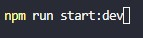
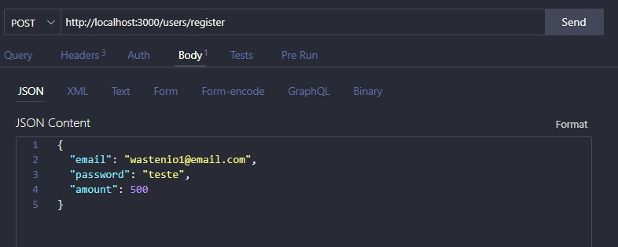
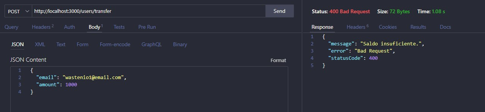
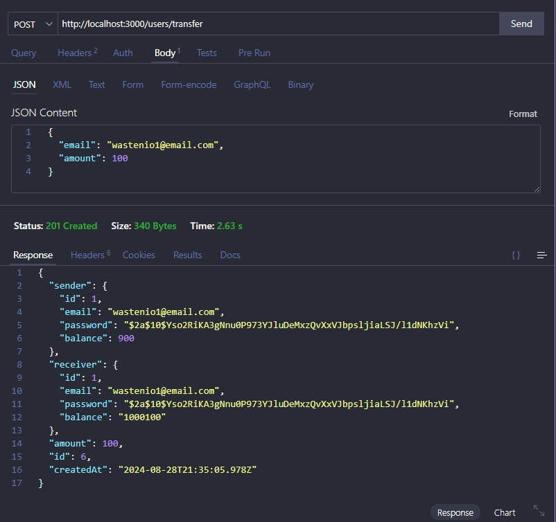

# Carteira Financeira

## Desafio 
O objetivo consiste na criação de uma carteira financeira em que os usuários possam realizar transferência de saldo. Teremos apenas um tipo de usuário que pode enviar ou receber dinheiro de qualquer outro.

## Requisitos do desafio
- Criar cadastro
- Criar autenticação
- Usuários podem enviar ou receber dinheiro
- Validar se o usuário tem saldo antes da transferência.
- A operação de transferência deve ser uma transação passível de reversão em qualquer caso de inconsistência ou por solicitação do usuário.

## Descrição
Esse projeto foi desenvolvido com  base em um desafio tecnico, onde no projeto foi criado as seguintes funcionalidades:

- Registro de usuario:
- Realização de transferencias de saldos.
- Atualização de saldo bancario.

Para o banco de dados, estou usando conexoes com o supabase, onde irá ser salvo o cadastro do usuario e todas as suas transações.

## Funcionalidades

1. para rodar o projeto executar o comando abaixo:

` npm run start:dev`

2. Para realizar o cadastro de usuario:
- Via postman acessar a url abaixo passando os parametro de email, password e amount via metodo json no BODY do postman:

`http://localhost:3000/users/register`

3. Para realizar transferencias de saldo:
- Via postman acessar a url abaixo passando os parametro de email e amount via metodo json no BODY do postman:

`http://localhost:3000/users/transfer`

4. Para realizar atualização de saldo:

- Via postman acessar a url abaixo passando os parametro de email e amount via metodo json no BODY do postman:

`http://localhost:3000/users/update-balance/id`

## Tecnologias utilizadas
- NodeJs
- NestJs
- TypeScript

## Instalação
1. Clone o repositório: `git clone https://github.com/wastenio/carteira-financeira.git`
2. Acesse o diretório do projeto: `cd carteira-financeira`
3. Instale as dependências: `npm install -f`

### Observações
1. Deve ser criado um arquivo chamado ormconfig.json dentro da raiz do projeto contendo as informações de acesso ao banco de dados.

-o arquivo ormconfig.json deve conter as informações abaixo no formato json:

    "type": "Tipo_Do_Banco",

    "host": "HOST_DO_BANCO",

    "port": PORTA_DE_CONEXAO_BANCO_DE_DADOS,

    "username": "USUARIO_BANCO_DADOS",

    "password": "SENHA_BANCO_DADOS",

    "database": "NOME_BANCO_DADOS",

    "entities": ["src/**/*.entity{.ts,.js}"],

    "synchronize": true,

    "logging": true

2. Deve ser criado um arquivo chamado app.module.ts dentro da pasta "src" contendo as configurações iguais as do arquivo ormconfig, para que possa ser realizado a conexao com o bando de dados.

- o arquivo app.module.ts deve conter as informações abaixo:

TypeOrmModule.forRoot({

      type: 'Tipo_Do_Banco',

      host: 'HOST_DO_BANCO',

      port: PORTA_DE_CONEXAO_BANCO_DE_DADOS,

      username: 'USUARIO_BANCO_DADOS',

      password: 'SENHA_BANCO_DADOS',

      database: 'NOME_BANCO_DADOS',
      
      entities: [User, Transaction],

      synchronize: true,

      logging: true,
    })